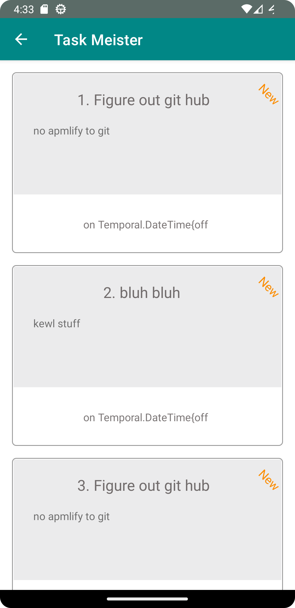
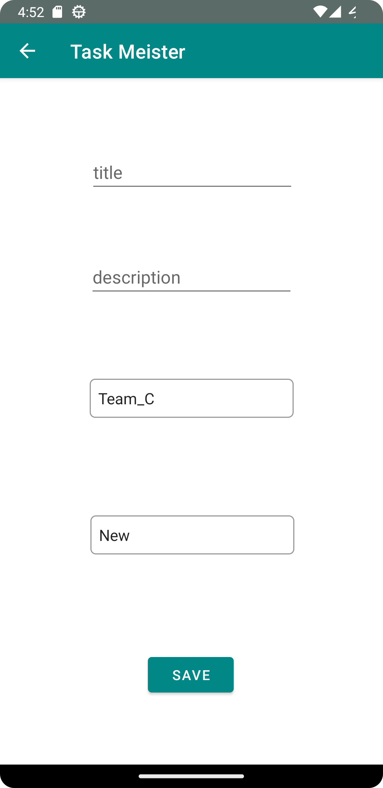
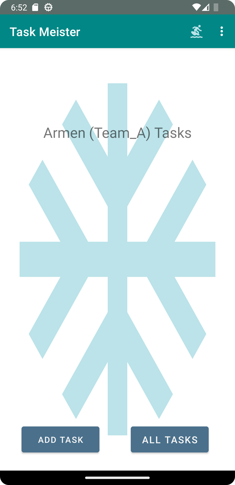
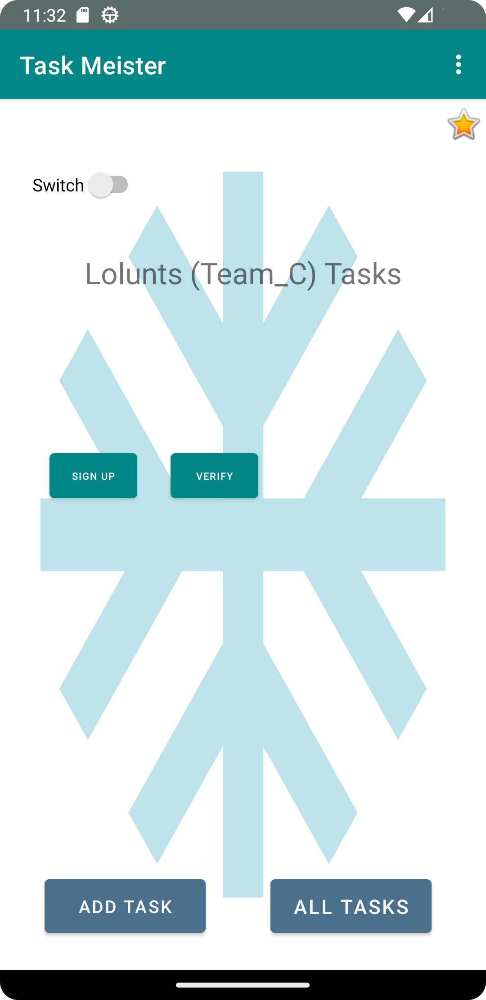
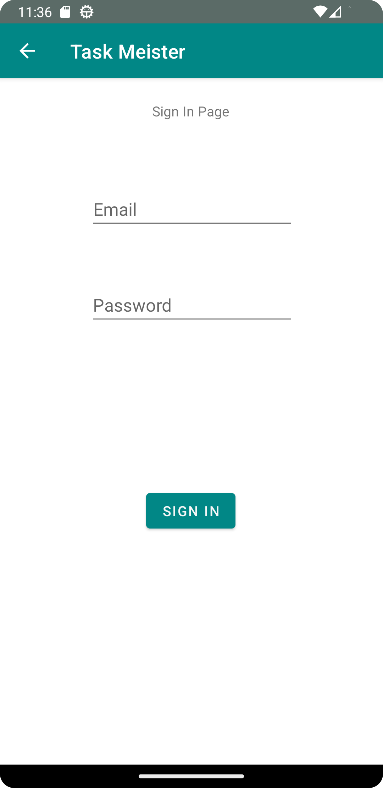
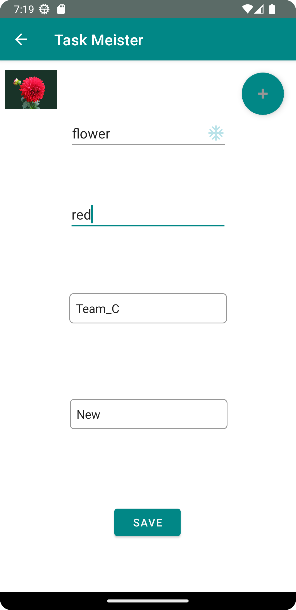
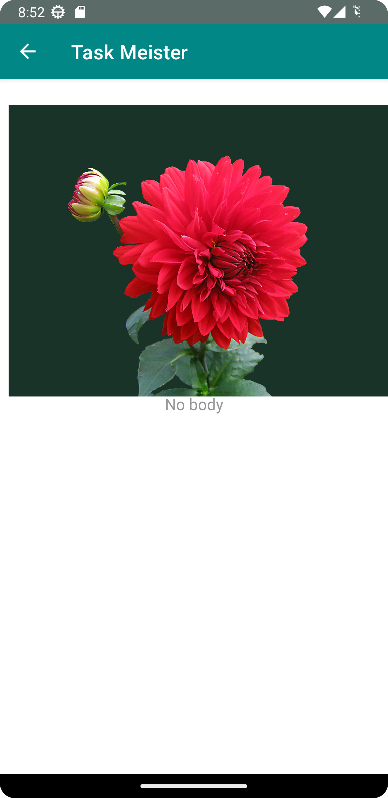
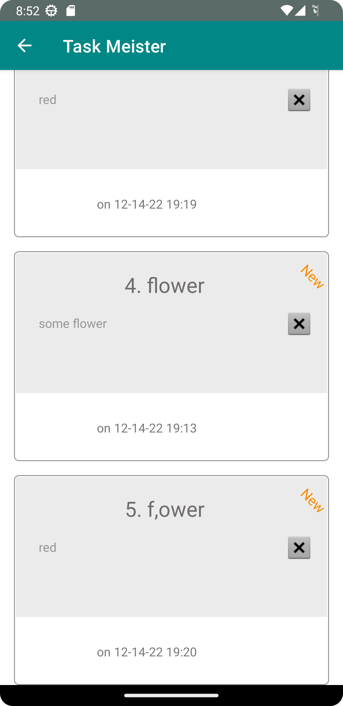

# Task Meister

#### Todo app #9999999999999999 (Android)


```12.01.2022 v.0.10a ```
* basic layout
* The toast implemented.

```12.04.2022 v.0.11```
* Three hardcoded buttons corresponding to the user tasks. Clicking on each will open "TaskDetails" activity with appropriate task title.
* Settings: Username can be stored via shared prefs for later retrieval within and without the app.

```12.05.22 v 0.12```
* Recycler view implemented
* Some styling.

```12.06.22 v 0.13```
* Rooms.
*  Adding task to database read/write functionality

* Winterized the styling.
* Basic Espresso test.


Odd bug - running Espresso test will wipe out data in
virtual phone's database

```12.07.22 v 0.14```
* rewired the app for amplify

```12.12.22 v 0.15``` 
* Implemented a new Team model in GraphQL and completable futures.
* Added additional settings field "Team".
* Added three hardcoded "teams" which can "own" tasks.
* The app saves and display (based on the settings entered), tasks assigned/owned by "Team".

Todo: fix time display in Tasks page.

```12.22.13```
* Added login/signin/signup functionality
* User Profile
* 
```12.14.22```
* Added image upload and display functionality
  ```12.15.22```
* Optimized imports, cleaned up and prepered the app for the google store. Graphics uploaded.
* Built signed AAB.
* Answered most of the questions and setup _internal_ testing.
* More readable temporal time display in recycler view.










amplify add storage
create/update, read, delete


You can tell git to stop ignoring changes to the file with:
```git update-index --no-assume-unchanged path/to/file
```