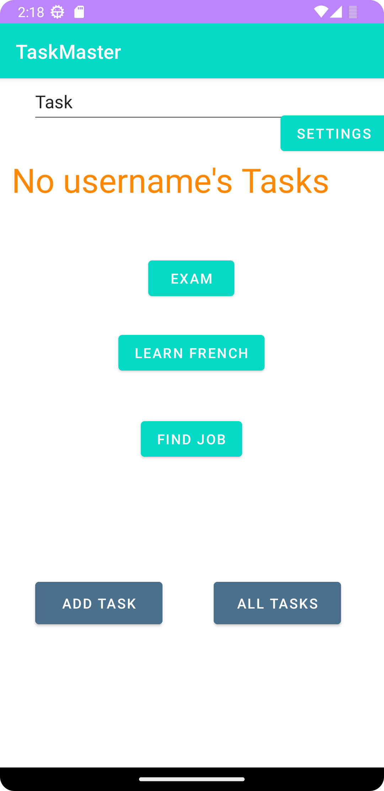
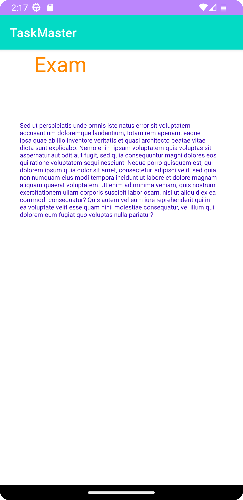

# TaskMaster

#### Todo app

android
12.01.2022 v.0.10a 
* basic layout
* The toast implemented.
12.04.2022 v.0.11
* Three hardcoded buttons corresponding to the user tasks. Clicking on each will open "TaskDetails" activity with appropriate task title.
* Settings: Username can be stored via shared prefs for later retrieval within and without the app.

